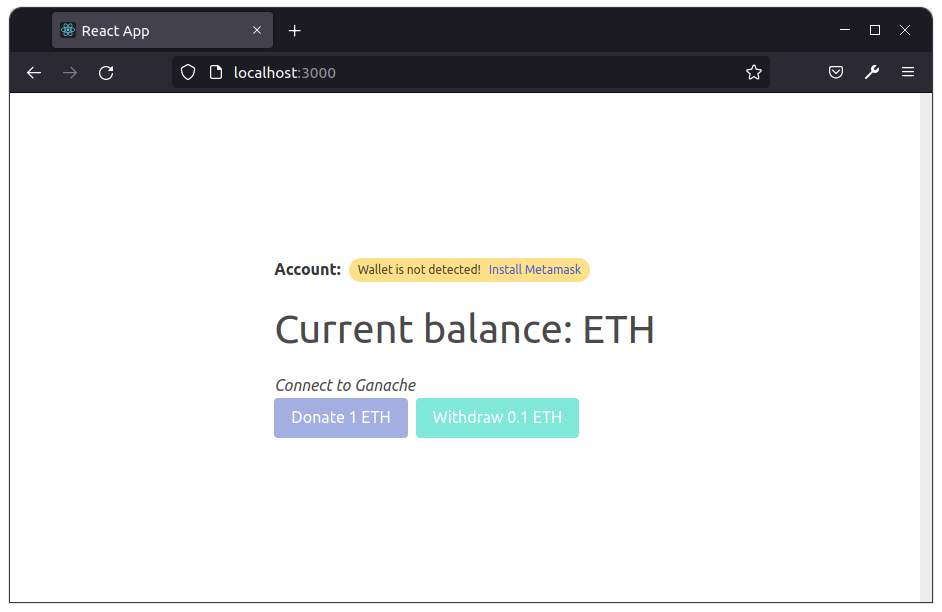

# Simple faucet application

A crypto faucet is an app or a website that distributes small amounts of cryptocurrencies. 

### To run this application

You should have truffle installed

`truffle compile` - compile the project

`truffle develop` - to deploy smart contracts, you are going to need to connect to a blockchain. Truffle has a built-in personal blockchain that can be used for testing. `migrate` - the command to deploy your compiled contracts to the blockchain

`npm i` - install all dependencies.

`npm start` - runs the app in the development mode. Open [http://localhost:3000](http://localhost:3000) to view it in the browser.

